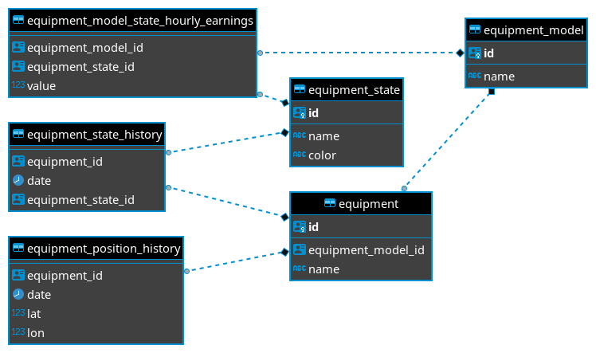

# Teste Estágio Backend V3


Neste teste serão avaliados seus conhecimentos em C# ou Java, banco de dados e a metodologia aplicada no desenvolvimento, arquitetura e organização da aplicação final.

## O Desafio

Você é o desenvolvedor backend de uma empresa que coleta dados de equipamentos utilizados em uma operação florestal. Dentre esses dados estão o histórico de posições e estados desses equipamentos. O estado de um equipamento é utilizado para saber o que o equipamento estava fazendo em um determinado momento, seja *Operando*, *Parado* ou em *Manutenção*. O estado é alterado de acordo com o uso do equipamento na operação, já a posição do equipamento é coletada através do GPS e é enviada e armazenada de tempo em tempo pela aplicação.

Seu objetivo é, de posse desses dados, desenvolver uma aplicação backend que exponha esses dados através de uma API.

## Requisitos

Esses requisitos são obrigatórios e devem ser desenvolvidos para a entrega do teste.

### O que é permitido

* C# (.NET, .NET Core, etc).
* Java (Spring, etc).
* Mapeamento objeto-relacional (ORM).
* Qualquer tecnologia (C#, Java) complementar as citadas anteriormente são permitidas desde que seu uso seja justificável.

### Requisitos técnicos

* **PostgreSQL**: Para o banco de dados deve ser utilizado o PostgreSQL.

### Requisitos de négocio

* **API de CRUD**: Você deve desenvolver uma API que exponha os métodos de Criar, Excluir, Editar e Ler para as seguintes entidades:
  * Equipamento.
  * Estado de equipamento.
  * Modelo de Equipamento.
  * Ganhos por hora por estado.
  * Histórico de posições de um equipamento.
  * Histórico de estados de um equipamento.

* **Estado atual do equipamento**: Endpoint na API que deve retornar o estado mais recente dos equipamentos.

* **Posição atual por equipamento**: Endpoint na API que deve retornar a posição mais recente dos equipamentos.

## Como restaurar o banco de dados

O dump do banco de dados necessário para realizar o teste está na pasta `/data`.

Exemplo de como restaurar o banco utilizando o `pg_restore`:
```sh
pg_restore -U [user] -d [dbname] -1 data.backup
```

## Dados 



### equipment
Contém todos os equipamentos da aplicação.

* **id**: Identificador único do equipamento.
* **equipment_model_id**: Chave estrangeira, utilizada para referenciar de qual modelo é esse equipamento.
* **name**: Nome do equipamento.

### equipment_state
Contém todos os estados dos equipamentos.

* **id**: Identificador único do estado de equipamento
* **name**: Nome do estado.
* **color**: Cor utilizada para representar o estado.

### equipment_model
Contém todos os modelos de equipamentos.

* **id**: Identificador único do modelo de equipamento.
* **name**: Nome do modelo de equipamento.

### equipment_model_state_hourly_earnings
Informação de qual é o valor por hora do modelo de equipamento em cada um dos estados.

* **equipment_model_id**: Chave estrangeira, utilizada para referenciar de qual modelo é esse valor.
* **equipment_state_id**: Chave estrangeira, utilizada para referenciar de qual valor é esse estado.
* **value**: Valor gerado por hora nesse estado.

### equipment_state_history
O histórico de estados por equipamento.

* **equipment_id**: Chave estrangeira, utilizada para referenciar de qual equipamento é esse estado.
* **date**: Data em que o equipamento declarou estar nesse estado.
* **equipment_state_id**: Chave estrangeira, utilizada para referenciar qual é o estado que o equipamento estava nesse momento.

### equipment_position_history
O histórico de posições dos equipamentos.

* **equipment_id**: Chave estrangeira, utilizada para referenciar de qual equipamento é essa posição.
* **date**: Data em que a posição foi registrada.
* **lat**: Latitude em WGS84.
* **lon**: Longitude em WGS84.

## O que não é permitido

* Utilizar códigos de terceiros que implementem algum dos requisitos.

## Extras

Aqui são listados algumas sugestões para você que quer ir além do desafio inicial. Lembrando que você não precisa se limitar a essas sugestões, se tiver pensado em outra funcionalidade que considera relevante ao escopo da aplicação fique à vontade para implementá-la.

* **Documentação da API**: Realizar a documentação da API desenvolvida.

* **Mapa de Equipamentos**: Contruir uma página que exiba a posição atual dos equipamentos em uma mapa.

* **Página Histórico de estados**: Página símples que exiba o histórico dos estados dos equipamentos.

* **Conteinerização**: Utilizar o docker para realizar a conteinerização da aplicação.

* **Testes**: Desenvolva testes que achar necessário para a aplicação, seja testes unitários, testes automatizados, etc.

* **Documentação da Aplicação**: Gerar uma documentação da aplicação. A documentação pode incluir detalhes sobre as decisões tomadas, especificação dos componentes desenvolvidos, instruções de uso dentre outras informações que achar relevantes.

## Entregas

Para realizar a entrega do teste você deve:

* Relizar o fork e clonar esse repositório para sua máquina.
  
* Criar uma branch com o nome de `teste/[NOME]`.
  * `[NOME]`: Seu nome.
  * Exemplos: `teste/fulano-da-silva`; `teste/beltrano-primeiro-gomes`.
  
* Faça um commit da sua branch com a implementação do teste.
  
* Realize o pull request da sua branch nesse repositório.
